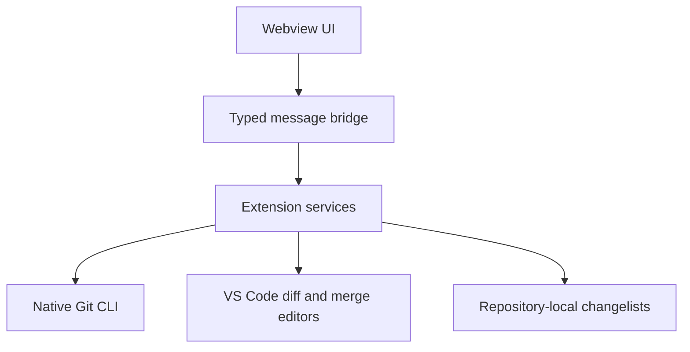

# Kivo Git product design

## Current release mode: strict parity

The active design target is defined in [`IDEA_PARITY.md`](./IDEA_PARITY.md). Until that contract passes user testing, implementation decisions are made by reference to Rebased and IntelliJ IDEA rather than by Kivo's own visual preferences. Kivo's name and mark remain, but spacing, hierarchy, density, motion, and interaction behavior must not be “improved” independently.

## Product promise

Kivo Git brings the Rebased/IntelliJ Git workflow to VS Code with the same bottom-tool-window mental model. It keeps native VS Code editors for code, diff, and merge work.

## Interaction model

| IDE workflow concept | Kivo Git behavior |
| --- | --- |
| Commit tool window | Persistent bottom Panel with `Local Changes` and `Log` as peer tabs |
| Local changelists | Named groups stored per repository under `.git/ideagit/` |
| Branch widget | One-click branch popup with local and remote branches plus ahead/behind state |
| Changes diff | Single-click for a focused preview; double-click or Enter pins VS Code's native diff editor |
| Git Log | A three-region workspace: branch navigator, dense table-oriented multi-lane commit DAG, and selected-commit details/file diffs |
| Update/push | Direct actions in the repository header with progress and result feedback |

## Visual language (parity mode)

Kivo Git uses the host theme and Codicons for platform integration, but the composition is reference-led: compact IDEA-style spacing, dense Log rows, a branch navigator, a filter strip, a graph-first history table, and a right-side details/files pane. The bottom Panel is the primary workspace: `Local Changes` and `Log` are the user-facing destinations, and Graph exists only as the first column of Log. Any Kivo-specific treatment is deferred until parity acceptance.

### Brand mark

The Kivo mark is a K drawn as a small commit topology: a stable vertical stem, two branching paths, and two terminal nodes. In the Panel it is monochrome and inherits the host theme; in Marketplace it sits in a blue-violet rounded square. The mark must remain legible at 16 px, avoid literal Git or JetBrains logos, and never rely on decorative detail to identify the product.

The repository header exposes upstream freshness and separate Pull/Push commit counts. A non-interactive background fetch refreshes remote refs while the view is visible; failures stay local to the sync status instead of interrupting editing with notifications.

## Motion language (deferred)

Do not add custom motion during parity mode. Use native/host transitions only where needed for basic feedback, and respect `prefers-reduced-motion`. The previous Kivo motion tokens are retained as a later enhancement proposal, not as an acceptance requirement.

## Architecture

The extension never stores credentials or tokens. Fetch, pull, and push are delegated to the user's existing Git installation and credential helper.

## Milestones

1. **Foundation:** real status, changelists, selective commit, branch popup, native diff, fetch/pull/push.
2. **Daily workflow:** graph history, branch operations, partial-hunk assignment, stash and shelf.
3. **Conflict workflow:** merge editor integration, rebase status, abort/continue actions.
4. **Polish:** multi-root repositories, performance work, keyboard map, accessibility audit, marketplace release.
