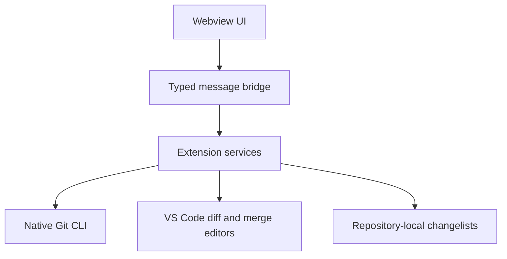

# Kivo Git product design

## Product promise

Kivo Git brings an IDE-style Git workflow to VS Code. It keeps the useful mental model—without copying another product's pixels—and keeps native VS Code editors for code, diff, and merge work.

## Interaction model

| IDE workflow concept | Kivo Git behavior |
| --- | --- |
| Commit tool window | Persistent sidebar with changelists, selection, message, and commit action |
| Local changelists | Named groups stored per repository under `.git/ideagit/` |
| Branch widget | One-click branch popup with local and remote branches plus ahead/behind state |
| Changes diff | Single-click for a focused preview; double-click or Enter pins VS Code's native diff editor |
| Git Graph | Real multi-lane commit DAG with branch refs, merge points, searchable commit details, and file diffs |
| Update/push | Direct actions in the repository header with progress and result feedback |

## Visual language

Kivo Git uses VS Code Codicons, host theme tokens, compact spacing, quiet surfaces, and a restrained lane palette for focus and active intent. Incoming, outgoing, active, warning, and destructive states remain visually distinct without turning the sidebar into a dense toolbar.

The repository header exposes upstream freshness and separate Pull/Push commit counts. A non-interactive background fetch refreshes remote refs while the view is visible; failures stay local to the sync status instead of interrupting editing with notifications.

## Motion language

Motion communicates state. The default timings are 80 ms for press feedback, 120 ms for hover, 160–190 ms for structural changes, and 230–260 ms for operation results. Every animation respects `prefers-reduced-motion`; keyboard focus and loading states remain clear when motion is disabled.

## Architecture

The extension never stores credentials or tokens. Fetch, pull, and push are delegated to the user's existing Git installation and credential helper.

## Milestones

1. **Foundation:** real status, changelists, selective commit, branch popup, native diff, fetch/pull/push.
2. **Daily workflow:** graph history, branch operations, partial-hunk assignment, stash and shelf.
3. **Conflict workflow:** merge editor integration, rebase status, abort/continue actions.
4. **Polish:** multi-root repositories, performance work, keyboard map, accessibility audit, marketplace release.
